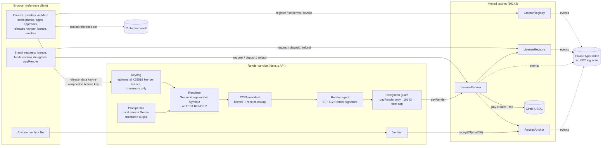

# Likeness

**Licence your face to AI, on your terms, and pull it back any time.**

Likeness is a likeness-licensing protocol on Monad, with a reference app on top:

- **Creators** prove they are a real, live adult, capture an encrypted reference set of their face,
  publish terms, and license their likeness.
- **Licensees** (brands) buy a licence, generate content through the render API, and pay per render
  from USDC escrow.
- **Every output carries a receipt**: a C2PA manifest in the file and an on-chain record keyed by the
  file's hash.
- **Anyone can verify** a file: Licensed, Expired, Revoked or Unknown.
- **Revocation is one click**: new renders are refused on the next block and unused escrow is
  refundable.

> **Status: Day 6.** Built: the contracts; licensing (terms, marketplace, EIP-712 approval or
> auto-approve, USDC escrow); per-licence key release; delegated render payments; the render pipeline
> (prompt filter, renderer, C2PA, `payRender`); the Envio indexer; the verifier; revocation; and
> dashboards. Creator verification runs on Didit, at `VERIFICATION_LEVEL=free` for now (passive
> liveness on Didit's free tier, reference photos matched on our server) and `full` for the live demo
> (active liveness, photos matched by Didit; needs Didit credit). Renders and the prompt filter run on
> Gemini. **Waiting on credentials:** Dynamic delegation and the server-wallet
> agent, and HyperSync (Envio). Each is behind an interface and
> switches on when its key is in `.env.local`. Until then the app says what isn't running; it never
> fakes a pass. The [credentials checklist](#credentials) lists every key and what it turns on.

## Architecture



**One render** checks that the licence is active and held by this brand, that it is under its cap,
that escrow covers the price, that the prompt passes the banned-use filter, and that the creator has
released their photos. Then it decrypts the reference images in memory, renders, embeds a signed C2PA
manifest, hashes the final file, and has the render agent sign `Render(licenceId, assetHash,
renderIndex, deadline)`. `LicenseEscrow.payRender` then records the usage, pays the creator and
anchors the receipt **in one transaction**. It is sent from the brand's wallet: either through the
brand's delegation (one click), or by the brand's own wallet, in which case the server holds the file
until the receipt is on chain.

## Protocol

Four contracts, in [`contracts/src`](contracts/src):

| Contract | What it holds | Who writes |
|---|---|---|
| [`CreatorRegistry`](contracts/src/CreatorRegistry.sol) | Platform-signed attestation (Didit: ID 18+, liveness, face match), terms, payout, revocation epoch | Creator (terms, payout, revoke-all); attester signs but cannot submit; owner rotates the attester and can suspend for abuse |
| [`LicenseRegistry`](contracts/src/LicenseRegistry.sol) | Non-transferable, expiring licence (ERC-721 locked per [ERC-5192](https://eips.ethereum.org/EIPS/eip-5192)) | Licensee requests (creator's EIP-712 approval, or auto-approve inside published terms); creator revokes; only the escrow counts renders |
| [`LicenseEscrow`](contracts/src/LicenseEscrow.sol) | USDC per licence; pays the creator per render, refunds the rest | Licensee deposits; a render needs the licensee's wallet **and** a render agent's signature |
| [`ReceiptAnchor`](contracts/src/ReceiptAnchor.sol) | One receipt per rendered file, looked up by hash | Only the escrow, only inside a paid render |

**Banned uses are enforced on chain.** Political, adult, anything involving minors, impersonation and
deception are a constant bitmask in [`Categories.sol`](contracts/src/Categories.sol). No terms, signed
deal or role can license them. The render API enforces the same list before generation.

**Neither key can spend alone.** `payRender` must be sent by the brand's wallet (in the app, a
Dynamic embedded wallet the brand delegates to the render service), and must carry a platform render
agent's signature over the exact file hash and render index. Money can only move to the creator's
payout address, the treasury (the fee) or back to the licensee.

**No biometric data on chain.** The chain holds hashes only: `referenceSetHash` is the hash of the
*encrypted* reference-set manifest, and `livenessSessionHash` is a hash of the Didit session ID.

## Running it locally

Needs Node 22 or later (`.nvmrc`) and Foundry 1.8.3 (for anvil and the contracts).

```sh
cd web
cp .env.example .env.local     # local defaults; add credentials as they arrive
pnpm install
pnpm c2pa:testcert             # once: a TEST C2PA signing chain in ../.secrets/c2pa
pnpm test                      # crypto, render pipeline, and the licence lifecycle on a Monad testnet fork
pnpm dev                       # http://localhost:3000
```

**The whole protocol in one command:**

```sh
pnpm demo --fork   # local anvil fork of Monad testnet: real contracts, Circle's real USDC contract
pnpm seed          # Monad testnet: the render agent, and a test brand wallet with gas
```

On the fork, the demo:

- registers a throwaway creator (attestation provider `dev-unverified`, synthetic drawings for photos);
- funds a test brand with USDC;
- creates a licence, deposits, and releases the key;
- runs two renders and verifies one file;
- revokes, shows the next render refused and the file now "licensed when made, since revoked", and
  refunds.

It prints every transaction hash. That test creator exists only on the fork. On Monad testnet the demo
runs in the app with a Didit-verified creator.

**Test brand.** With `DEV_WALLETS=1` in `.env.local`, the header picker can act as the test brand,
marked DEV. The choice is per tab, so one tab can be the brand while another uses your own wallet.

**Indexer.** [`indexer/`](indexer) is an Envio HyperIndex for all four contracts.
`cd indexer && pnpm install && pnpm local` runs it against Monad testnet with an embedded Postgres; no
Docker is needed. Then set `ENVIO_PG_URL` in `web/.env.local`. Without an indexer, the app reads
history from cached RPC log scans; current state always comes from the contracts.

### Deploying

The app runs best as **one always-on container** with a persistent volume. Render keys and matched
capture digests live in that server's memory by design, and the free-level face model (260 MB) lives on
its volume. [`web/Dockerfile`](web/Dockerfile) builds it and [`web/railway.json`](web/railway.json)
configures Railway. Any Docker host works the same way.

**On Railway:**

1. **New project → Deploy from GitHub repo.** In the service settings:
   - set **Root Directory** to `web` (Railway then uses `railway.json` and the Dockerfile);
   - keep **one replica**.
2. **Add a volume** to the service, mounted at `/data`. Records, ciphertext, renders, the history
   cache and the face models go there.
3. **Networking → Generate domain.** Note it, e.g. `likeness-production.up.railway.app`.
4. **Variables.** Set these before the first build, because the public ones are compiled into the page:
   - `NEXT_PUBLIC_RP_ID`: the domain, with no scheme;
   - `NEXT_PUBLIC_APP_URL`: `https://` plus the domain;
   - `NEXT_PUBLIC_DYNAMIC_ENV_ID`;
   - the secrets, as values:
     - `ATTESTER_PRIVATE_KEY`, `DRIP_PRIVATE_KEY`, `RENDER_AGENT_PRIVATE_KEY`;
     - `C2PA_CERT_PEM`, `C2PA_KEY_PEM`;
     - `DIDIT_API_KEY`, `VERIFICATION_LEVEL`, `DIDIT_WORKFLOW_ID_FREE`, `DIDIT_WORKFLOW_ID_FULL`;
     - `GEMINI_API_KEY`, `GEMINI_IMAGE_MODEL`, `GEMINI_IMAGE_SIZE`, `GEMINI_FILTER_MODEL`;
     - optionally `DIDIT_WEBHOOK_SECRET`, `DYNAMIC_API_KEY`, `DYNAMIC_WEBHOOK_SECRET`,
       `DYNAMIC_DELEGATION_PRIVATE_KEY_PEM`, `DYNAMIC_AGENT_JSON`.

   Leave `DEV_WALLETS` and `DEV_DELEGATION` unset. The Dockerfile already sets the `/data` paths.
5. **Dynamic:** add `https://<domain>` to the environment's allowed origins. **Didit:** to use its
   webhook instead of polling, point it at `https://<domain>/api/didit/webhook`.

On first boot the container downloads the face models to the volume when `VERIFICATION_LEVEL=free`. It
then builds the history cache in the background: about 15 minutes for the 1.3M blocks since deployment,
with pages answering throughout. Passkeys are bound to the domain. A creator onboarded on `localhost`
cannot release photos on the deployed site, so onboard creators there.

**Vercel** also builds the app ([`web/vercel.json`](web/vercel.json), `STORE_DRIVER=blob`,
`pnpm index:seed-blob`), with known limits:

- across serverless instances, a photo release or a matched-photo record can be missing, so renders and
  registration may need a retry;
- the free-level face matcher is above the function size limit, so it does not run.

## App

[`web/`](web) is a Next.js 16 app, the protocol's reference client.

| Path | What it does |
|---|---|
| `/` | Landing: how a licence runs, measured numbers, real creators, and the call to become one |
| `/onboard` | Three steps. **Sign in:** email creates the embedded wallet (Dynamic) and MON for gas arrives in the background. **Verify it's you:** signed consent, then Didit (ID 18+, liveness, selfie-to-ID face match). **Capture and protect:** three photos, each face-matched to the liveness selfie, then one button creates the passkey (Mera), seals the photos, gets the attestation and calls `register` |
| `/market`, `/market/[creator]` | Registered creators with their trust label and terms; request a licence: auto-approved, or sent for the creator's EIP-712 signature |
| `/dashboard` | Creator: terms editor, pause, approve or decline requests, release photos per licence, revoke one or all, earnings. Brand: USDC, deposit, refund, delegation, renders |
| `/generate` | Every check before the button; render, C2PA, `payRender` (delegated or from the wallet) |
| `/verify` | Upload a file or paste its sha256: Licensed / Expired / Revoked / Unknown, with terms, creator and dates |
| `/status` | Each integration: configured or not, what it turns on, which variable; the four contracts for AI tools and verifiers |

API routes live under [`web/app/api`](web/app/api). The server modules they call are in
[`web/lib/server`](web/lib/server): `generate`, `verify`, `keyring`, `delegation`, `filter`, `render/*`,
`c2pa`, `protocol` and `index/*`.

### Tests

```sh
cd contracts && forge test        # unit, fuzz, invariant; with MONAD_RPC_URL set, also the Monad testnet fork suite
cd web && pnpm test               # 29 tests
cd indexer && pnpm test           # Envio handlers on the in-memory test indexer
```

- **Contracts.** Every revert path. Fuzz tests check that banned bits are never stored or licensed,
  and that each render conserves funds. The invariant suite (256 runs × 64 calls, 0 reverts) checks
  conservation of USDC, renders within cap, renders paid for, and refunds reaching only licensees.
- **Licence lifecycle on an anvil fork of Monad testnet**
  ([`lifecycle.fork.test.ts`](web/lib/server/lifecycle.fork.test.ts)). This uses the deployed contracts,
  Circle's real USDC contract and the app's own server modules, with no mocks. It covers:
  - registering the dev-unverified creator;
  - a request refused outside the terms, and a forged approval refused;
  - the creator's EIP-712 approval → issue, then replay refused;
  - the deposit;
  - key release, including releases with the wrong licence or the wrong key refused;
  - delegated `payRender` through the policy guard: wrong function, contract, chain or value refused,
    and the total cap enforced;
  - generation with the DevRenderer and C2PA, in delegated and wallet modes;
  - verification: Licensed, and Unknown after re-encoding;
  - revoke: keys dropped, render refused, "licensed when made, since revoked";
  - the refund, and revoke-all.
- **Render pipeline** ([`pipeline.test.ts`](web/lib/server/pipeline.test.ts)): the banned-use rules,
  the DevRenderer, the C2PA round trip, and tamper detection.
- **Crypto** ([`crypto.test.ts`](web/lib/crypto/crypto.test.ts)): the cross-device passkey test,
  namespace isolation, envelope binding and licence release.
- **Indexer** ([`indexer.test.ts`](indexer/src/indexer.test.ts)): a licence from registration to
  refund, plus revoke-all and suspension.

## Deployments (Monad testnet, chain 10143)

Deployed 2026-10-05 (UTC) from `0x68343Aa0598b7FCAA102769D172e59cdDfae10f2`. All four contracts are
verified on Sourcify (MonadVision). `ReceiptAnchor` is an exact match; the others are a `match`
(bytecode identical, metadata hash differs). Machine-readable:
[`deployments/monad-testnet.json`](deployments/monad-testnet.json).

| Contract | Address | Deploy tx |
|---|---|---|
| CreatorRegistry | [`0x680A55c0Db4B44def9d88cCBF450C1f5dd37fd9a`](https://testnet.monadvision.com/address/0x680A55c0Db4B44def9d88cCBF450C1f5dd37fd9a) | [`0x7ff23bdd…`](https://testnet.monadvision.com/tx/0x7ff23bdd2ff2a4c7d1826cd61ddc5ff301bf32c70e6a1fec7f9abbb5c9833e4f) |
| LicenseRegistry | [`0x87934d5E1A61be3Bb06FE54AC7e21E7704731d1C`](https://testnet.monadvision.com/address/0x87934d5E1A61be3Bb06FE54AC7e21E7704731d1C) | [`0xa259fc3a…`](https://testnet.monadvision.com/tx/0xa259fc3abc96c6d94e5cc1a0058ab7968e6ee5875022ba586ca622649c443b6e) |
| ReceiptAnchor | [`0xE33Dc788C060cb77F79A2AFF96Ca685f6C018721`](https://testnet.monadvision.com/address/0xE33Dc788C060cb77F79A2AFF96Ca685f6C018721) | [`0x01b8044a…`](https://testnet.monadvision.com/tx/0x01b8044adb68cc5d7ce3ea0cdc7a2a06907f19fc8a5720d3ecefe8ff5b2ee4aa) |
| LicenseEscrow | [`0x38703a57c5f8eB2F8d1576A3d2B4B35A10D66FA6`](https://testnet.monadvision.com/address/0x38703a57c5f8eB2F8d1576A3d2B4B35A10D66FA6) | [`0x102546c7…`](https://testnet.monadvision.com/tx/0x102546c7462535ac715bb6b33af0f158be0b38a34f913df2357d1602b4209a9d) |
| USDC (Circle) | [`0x534b2f3A21130d7a60830c2Df862319e593943A3`](https://testnet.monadvision.com/address/0x534b2f3A21130d7a60830c2Df862319e593943A3) | [Circle docs](https://developers.circle.com/stablecoins/usdc-contract-addresses) |

Wiring transactions:

- `LicenseRegistry.setEscrow`: [`0xa09d4351…`](https://testnet.monadvision.com/tx/0xa09d43517ff7228662304046c5c6fc5bfff85940110a2b8ae06e4bf7baa8c373)
- `ReceiptAnchor.setEscrow`: [`0x22bf5160…`](https://testnet.monadvision.com/tx/0x22bf5160c02d4bdeaaf902dbe0a2d56665e410683855fa2b51aba790f2068d61)
- `LicenseEscrow.setRenderAgent` (deployer): [`0x5b789333…`](https://testnet.monadvision.com/tx/0x5b7893332ebfad9aa08ad87078d3a315705954ccffb0478165375081359aba5e)
- `LicenseEscrow.setRenderAgent` (dedicated render-agent key `0x87CA75118FD0C7EF3090c82E8df4CF4b56cD03cA`): [`0x682b6cf8…`](https://testnet.monadvision.com/tx/0x682b6cf831d0ac83e969ab48bc824aeda97587b6f672973ed557b3ac81090979)

Roles:

- **Attester:** `0x8d53e13407890e18022bfAa413193ba4C6DCc1a5`.
- **Render agents:** `0x87CA75118FD0C7EF3090c82E8df4CF4b56cD03cA`, the render service's local key
  (`RENDER_AGENT_KEY_FILE`). The deployer is also still registered. It moves to a Dynamic server
  wallet with `pnpm agent:dynamic` once `DYNAMIC_API_KEY` is set.
- **Treasury:** the deployer.
- **Fee:** 10%.

An earlier unverified test creator (`0xB6f4…0e21`, provider `dev-unverified`) was suspended by the
owner on 2026-10-10 ([`0xc2453bfb…`](https://testnet.monadvision.com/tx/0xc2453bfb78a2d217d46ad148e85ec9691bda8f62983dbb560aa10a5c02803916)).
That revoked its only licence (#1), and it can never license again. Registrations cannot be deleted
on chain, so it is still recorded there, but the marketplace lists only Didit-verified creators.

## Why Monad

Pay-per-render means **one on-chain transaction per generated image**: usage, payment and receipt
together, sent before the file reaches the brand.

- **Gas, measured.** `payRender` used **368,502 gas** for a licence's first render (cold storage) and
  **300,502 gas** for later ones. These are from `pnpm demo --fork`: the deployed bytecode and state on
  an anvil fork of Monad testnet, with Circle's USDC contract. Monad charges the gas **limit**, not gas
  used ([gas pricing](https://docs.monad.xyz/developer-essentials/gas-pricing.md)), so the service sends
  the estimate + 15%. At the 102 gwei testnet gas price measured on 2026-10-06, that is about
  **0.043 MON** for a first render and **0.035 MON** after. That is small next to a per-render price.
- **Confirmation, measured on Monad testnet** (send to receipt through the public RPC, polling):
  - `register`: 853 ms;
  - `setRenderAgent`: 557 ms;
  - licence `request` from the browser: 582 ms;
  - MON transfers: 945 ms and 1,450 ms.

  Monad documents 300 ms block frequency and 600 ms finality
  ([docs](https://docs.monad.xyz/introduction/monad-for-users.md)), so the receipt is final before the
  file is delivered, and a revocation binds the next render.
- **Not yet measured on testnet:** `payRender`'s own confirmation time. It needs Circle testnet USDC
  in the demo funder (see [credentials](#credentials)); `pnpm demo` prints it.

## Threat model and honest limits

What the design defends against:

- **A brand using a likeness outside its licence.**
  - Every render needs an active licence, the creator's released key, a passing prompt check and a
    paid `payRender`.
  - Revocation stops renders at the next block.
  - Banned uses are rejected on chain and by the render API.
- **The platform overspending a brand's escrow.**
  - `payRender` needs the brand's own wallet; delegated sends pass a payRender-only guard with a total
    cap.
  - The contract caps each payment at the licence price and pays only the creator, the fee and refunds.
- **Faked receipts.**
  - A receipt exists only inside a paid `payRender` carrying a render agent's signature over that exact
    file hash.
  - The verifier trusts the on-chain receipt over any manifest claim.
- **Creators sealing someone else's photos.** Didit matches the liveness selfie to the ID document,
  and each of the three reference photos to that selfie (1:1 face match). The attester signs only a
  reference set whose plaintext digests equal those matched photos, and the render service re-checks
  every digest after decryption.
- **Faked verification results.** The browser never reports a result. The server reads Didit's
  decision from Didit's API (or its HMAC-signed webhook), computes 18+ itself from the document's date
  of birth, and requires ID, liveness and face match all approved.

What it does not do, plainly:

- **Google sees the reference photos.** The Gemini image model receives the decrypted captures for
  each render. On a billed (paid) key, Google doesn't use prompts or responses to improve its products.
  It does log them for 55 days for abuse monitoring, with possible human review of flagged content
  ([Gemini API terms](https://ai.google.dev/gemini-api/terms),
  [usage policies](https://ai.google.dev/gemini-api/docs/usage-policies)). A free-tier key must never
  carry creators' photos: free-tier inputs may be used to improve Google's products and read by human
  reviewers. We call `generateContent`, which does not store requests (the newer Interactions API does
  unless `store:false`).
- **No TEE.** The render service holds each licence's key and the decrypted images in ordinary process
  memory. An operator with access to the host could read them. Keys are dropped on revoke, expiry or
  restart, and buffers are zeroed after use, but that is hygiene, not isolation.
- **Didit, what it is and what it keeps.**
  - **Certification:** Didit's liveness is certified to **iBeta ISO/IEC 30107-3 PAD Level 1**, not
    Level 2 ([certifications](https://docs.didit.me/getting-started/certifications), letter dated
    2026-02-04). Didit doesn't say which liveness method was tested.
  - **Two verification levels** (`VERIFICATION_LEVEL` in `web/.env.local`), each with its own published
    Didit workflow. Both check the ID document (18+ from the date of birth) and match the liveness selfie
    to the document photo.
    - **`full`, for the live demo:** active liveness (`ACTIVE_3D`; desktop not allowed, because Didit
      falls back to passive on desktop), and Didit's 1:1 face match for the three reference photos. It
      needs Didit credit.
    - **`free`, for now:** passive liveness, within Didit's free tier, and the reference photos matched to
      the liveness selfie on our own server by an open-source matcher (below).
  - **Passive liveness is weaker.** It judges a single capture without asking the person to do anything,
    so it resists deepfakes, replayed video and virtual-camera injection less well than active liveness.
    Treat creators verified at `free` as lower assurance.
  - **The level is on chain and on screen.** The attestation records it: `ageProvider` is `didit`, and
    `livenessProvider` is `didit:passive` or `didit:active`, written from the liveness Didit actually
    ran, not the one the workflow asked for. The marketplace, the creator profile and the verifier show
    it, with a warning for passive.
  - **Upgrades only.** A registered creator can choose **Re-verify at a higher level** on the
    dashboard. The flow:
    1. They sign the consent again.
    2. Didit runs a new session at the server's current level.
    3. Their three sealed reference photos are decrypted in their browser and re-checked against the new
       liveness selfie.
    4. The attester signs a new attestation for the same reference set, sent with
       `CreatorRegistry.updateAttestation`.

    The attester refuses anything that is not strictly stronger (passive → active), so a level can never
    be lowered. The profile and the verifier show when the upgrade happened. Files made before it are
    flagged as made under the earlier level.
  - **Free tier and cost:**
    - Until 2026-10-31, the first 500 checks a month per feature are free for ID verification,
      passive liveness and face match. Active liveness ($0.15) and the standalone face-match API
      ($0.05 a call) are never free.
    - From 2026-11-01, Didit gives $10 of credit a month instead.
    - One creator costs about $0.35 for the session plus $0.15 for the three photo matches
      ([pricing](https://docs.didit.me/getting-started/pricing)).
    - Sandbox applications are free, but their results are mocked; such creators are attested as
      `didit-sandbox`.
  - **Storage:**
    - Didit processes in the EU on AWS, as our processor.
    - Its default retention is **unlimited** (configurable from 1 month to 10 years in its console), and
      it uses data for **model training by default** (org-level opt-out)
      ([data retention](https://docs.didit.me/console/data-retention)).
  - **What we do about it:**
    - We ask Didit not to keep a Face Search embedding (`face_search_enabled: false`).
    - We call the photo matches with `save_api_request=false`.
    - We delete the Didit session with `privacy_erasure` as soon as the attestation is signed.
    - The retention period and the training opt-out are console settings the operator must set.
  - **What we keep:** the outcome, the checks that passed, and the session ID. Never the date of birth,
    document images or selfie.
- **The local face matcher (free level).**
  - **Stack:** YuNet detection, five-point alignment to the ArcFace template, AuraFace v1 (`glintr100`)
    embeddings and cosine similarity. It runs in onnxruntime-node on our server, in memory, storing
    nothing ([`facematch.ts`](web/lib/server/facematch.ts); models from `pnpm face:models`, pinned by
    sha256).
  - **Known limitation: the YuNet detector was trained on a non-commercial dataset.** Its weights are
    MIT, but it was trained on WIDER FACE, whose images are licensed CC BY-NC-ND. The production
    replacement is Google's MediaPipe **BlazeFace** detector (Apache-2.0 model card), which needs
    converting from TFLite to ONNX. BlazeFace gives six keypoints with a mouth centre, so the alignment
    changes from five points to four. It is not swapped yet.
  - **Licences:**
    - The code is MIT (onnxruntime-node).
    - The AuraFace weights are Apache-2.0; fal says its training data is commercially usable but does not
      name the dataset.
    - We use none of the InsightFace files, including the InsightFace copies in AuraFace's repository.
    - Have counsel review before production use.
  - **Calibration is thin.** On 2026-10-10:
    - one person's three real photos scored 0.62–0.74 against each other;
    - that person against six invented faces scored at most 0.24;
    - the invented faces against each other scored at most 0.54.

    The default threshold of 0.55 (`LOCAL_FACE_MATCH_THRESHOLD`) sits above every impostor pair seen.
    It needs real data before it is trusted.
- **The C2PA certificate is a test certificate.** It is generated locally and not on the C2PA trust
  list, so validators report "signing certificate untrusted"; the verifier says so.
- **Two independent provenance marks.** Every Gemini render carries Google's invisible
  [SynthID](https://ai.google.dev/gemini-api/docs/image-generation) watermark ("All generated images
  include a SynthID watermark") as well as our C2PA manifest and on-chain receipt. The verifier page
  does not read SynthID; detection is through Google's tools.
- **Receipts bind exact bytes.** A re-encoded, cropped or screenshotted copy has a different hash and
  verifies as Unknown. No perceptual matching or watermark is used.
- **Revocation is not recall.** Files delivered before a revocation still exist; they verify as
  "licensed when made, since revoked".
- **Dynamic policy coverage.**
  - Dynamic's signer-layer rules enforce chain ID and touched addresses. The SDK states that
    `functionName`, `contractAbi` and `valueLimit.totalLimit` are not evaluated on signer layers.
  - The payRender-only and total-cap rules are therefore enforced by our server guard and by the
    contract, not by Dynamic.
  - Delegated access is sandbox-only without a Dynamic Enterprise plan.
  - Whether Dynamic's policy simulation covers chain 10143 is untested until credentials arrive.
- **Central attester.** One platform key attests creators. It can be rotated (`setAttester`), but it is
  trusted.
- **The fork test creator** (`pnpm demo --fork` and the fork tests only).
  - Its attestation carries `adult: true`, because `CreatorRegistry` only registers adults, but both
    provider fields say `dev-unverified`.
  - Every reader labels it unverified, and it never touches Monad testnet.
- **Off-chain records** (pending requests, briefs, delegation grants, render files) are local JSON and
  files under `web/.data`, or Vercel Blob. They are not replicated.

## Using Gemini within Google's terms

Constraints from the [Gemini API Additional Terms](https://ai.google.dev/gemini-api/terms) and the
[Generative AI Prohibited Use Policy](https://policies.google.com/terms/generative-ai/use-policy). Each
is matched by the design or flagged:

- **Paid tier only for real creators.** Free-tier ("Unpaid Services") inputs may be used to improve
  Google's products and read by human reviewers; the terms say not to send personal information there.
  The image models have no free tier anyway.
- **Adults only.** The API may not be used in an app "likely to be accessed by individuals under the
  age of 18". Creators are attested 18+; the app must also be presented as adults-only to brands.
- **Consent for biometrics.** "Using personal data or biometrics without legally-required consent" is
  prohibited.
  - Before any verification, creators read and sign a versioned consent
    ([`lib/consent.ts`](web/lib/consent.ts)) with an unticked checkbox. It names Didit and Google, links
    Didit's notices, and covers biometric processing. The signed statement is stored.
  - Whether that meets GDPR or BIPA requirements for a given jurisdiction needs legal review.
- **No impersonation, no hiding AI.** Impersonating someone "without explicit disclosure, in order to
  deceive", and presenting generated content as made solely by a human, are prohibited. Banned on chain
  and in the filter; C2PA marks every output as AI-generated (`trainedAlgorithmicMedia`).
- **No sexual content, no getting around safety filters.** Adult content is banned on chain. Gemini's
  own safety blocks are surfaced as failures, never retried around.
- **EEA, UK and Switzerland** users may be served only through paid services.
- **Possible refusals for well-known people.** Google's image safety filters may refuse photorealistic
  images of celebrities. Unverified for this API, so creators who are public figures may see failed
  renders.

## Credentials

Each one goes in `web/.env.local` (or `indexer/.env`) and switches on one feature. `/status` shows
what is live.

| Feature | Variables | Without it |
|---|---|---|
| Sign-in and embedded wallets (Dynamic) | `NEXT_PUBLIC_DYNAMIC_ENV_ID` | Wallets off; only seeded DEV wallets act |
| Delegated render payments (Dynamic) | `DYNAMIC_API_KEY`, `DYNAMIC_WEBHOOK_SECRET`, `DYNAMIC_DELEGATION_PRIVATE_KEY_FILE` | Brands confirm each `payRender`; DEV delegation for the test brand |
| Render agent as a Dynamic server wallet | `DYNAMIC_API_KEY`, then `pnpm agent:dynamic` | Local agent key signs renders |
| Creator verification (Didit: ID 18+, liveness, face match) | `DIDIT_API_KEY`, `VERIFICATION_LEVEL` (`free` or `full`), `DIDIT_WORKFLOW_ID_FREE`, `DIDIT_WORKFLOW_ID_FULL` (optional `DIDIT_WEBHOOK_SECRET`); `full` needs **Didit credit**; `free` needs `pnpm face:models` | "Liveness not configured and ID check not performed"; no creator can be verified |
| Renders and the LLM prompt filter (Google Gemini) | `GEMINI_API_KEY` (optional: `GEMINI_IMAGE_MODEL`, `GEMINI_FILTER_MODEL`); **billing on the key's Google Cloud project** for the image model | A TEST RENDER, and "LLM filter not configured": local rules only |
| Envio via HyperSync | `ENVIO_API_TOKEN` in `indexer/.env` | The indexer syncs over RPC, more slowly |
| Testnet `payRender` in `pnpm demo` | Circle testnet USDC in the demo funder (`0x68343Aa0…10f2`) or the test brand | `pnpm demo --fork` |

## AI tool disclosure

This project was built with an AI coding assistant, **Claude Code (Anthropic), running Claude Opus
5.5**, working under the team's direction. The team set the product and the rules: no plaintext
biometrics, banned categories on chain, never faking a pass, and keeping real and stubbed parts
honestly apart. The team also approved the plan and the build order. The assistant researched the
official docs, wrote the code and tests, ran them, and deployed and seeded on testnet.

| Area | Written by | Reviewed by the team |
|---|---|---|
| Plan, research and doc citations | AI assistant | Plan approved |
| Contracts (`contracts/src`) | AI assistant | Pending |
| Contract tests, invariant suite, deploy script | AI assistant | Pending |
| Crypto library and tests (`web/lib/crypto`) | AI assistant | Pending |
| Onboarding, wallet and keys panels, vault and drip routes (Days 2–3) | AI assistant | Pending |
| Licensing, key release, delegation, render pipeline, C2PA, verifier, dashboards (Days 4–6) | AI assistant | Pending |
| Envio indexer (`indexer/`) | AI assistant | Pending |
| Demo and seed scripts, fork lifecycle test | AI assistant | Pending |
| README and docs | AI assistant | Pending |

This table is updated as the team reviews each part.

## Pre-existing code

Built from scratch during the hackathon, except:

- **Libraries:** [OpenZeppelin Contracts](https://github.com/OpenZeppelin/openzeppelin-contracts)
  v5.7.0 and [forge-std](https://github.com/foundry-rs/forge-std) v1.17.0, pinned as git submodules.
- **Libraries:** the app's dependencies are pinned in [`web/package.json`](web/package.json), and the
  indexer's in [`indexer/package.json`](indexer/package.json).
- **Design:** the web app follows the team's design mockups (Main, Marketplace, Dashboard and
  Verify), rebuilt as Next.js components:
  - the palette, the Unbounded + Poppins pairing, the radii and the motion are tokens in
    [`web/app/globals.css`](web/app/globals.css);
  - the shared components (pills, cards, hero, panel, icons, reveal and count-up hooks) are in
    [`web/components/ds/`](web/components/ds/).

  An earlier version used colour token names, a font pairing and a focus-ring rule from the team's
  earlier project, Whistle. The old token names (ground, panel, line, text, muted and so on) still
  exist, mapped onto the new palette, so older components keep rendering; no Whistle colours,
  application or contract code remain.

## Licence

[MIT](LICENSE)
